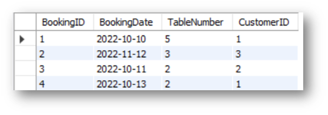
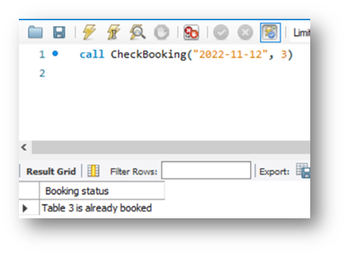
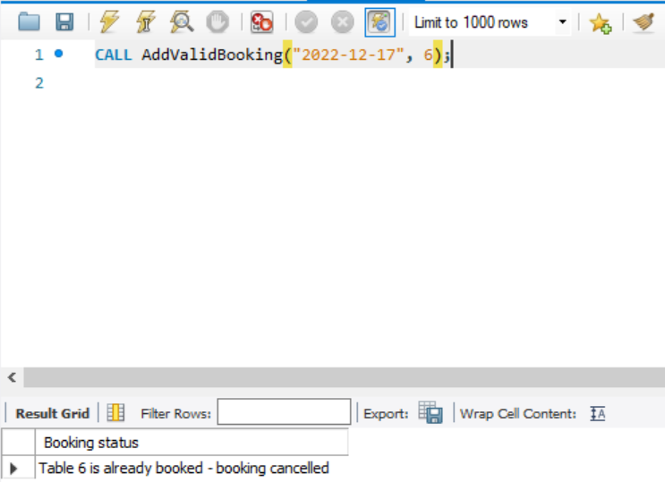
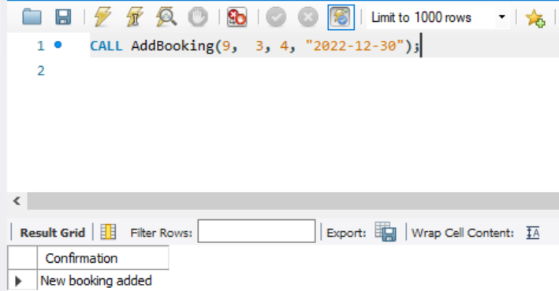
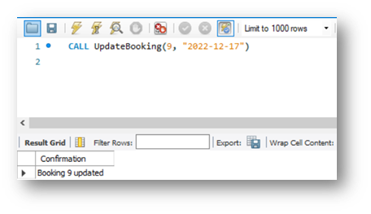
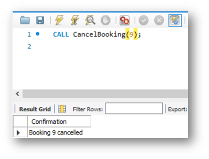

# Table of contents

1. [Introduction](#introduction)

2. [Week 1 solutions](#week-1)

3. [Week 2 solutions](#week-2)

# Introduction

This is the project for the course Database Engineer Capstone, which is also the collections of solutions in each module.

# Week 1

## Exercise: Create an ER diagram data model and implement it in MySQL

### Task 1

In this task, you need to create a normalized ER diagram (that adheres to 1NF, 2NF and 3NF) with relevant relationships to meet the data requirements of Little Lemon. When creating your diagram, include the following tables:

- Bookings: To store information about booked tables in the restaurant including booking id, date and table number.
- Orders: To store information about each order such as order date, quantity and total cost.
- Order delivery status: To store information about the delivery status of each order such as delivery date and status.
- Menu: To store information about cuisines, starters, courses, drinks and desserts.
- Customer details: To store information about the customer names and contact details.
- Staff information: Including role and salary.


### Task 2

In this second task, you need to implement the Little Lemon data model inside your MySQL server. Here is some guidance for completing this task:

- Use the forward engineer method in MySQL Workbench to implement the Little Lemon data model inside MySQL server. 
- Name your database LittleLemonDB. 
- Export the LittleLemonDB as a single contained SQL file and save it in the db-capstone-project folder.

check the file [forward engineer scripts.sql](./week%201/forward%20engineer%20scripts.sql) in the folder [week 1](./week%201/)

### Task 3
In the third and final task, you need to show the databases in the MySQL server. Write a SQL code inside MySQL Workbench SQL editor to show all your databases in MySQL server. Check if the Little Lemon database is included in the list.


# Week 2

## Exercise: Create a virtual table to summarize data

### Task 1
In the first task, Little Lemon need you to create a virtual table called OrdersView that focuses on OrderID, Quantity and Cost columns within the Orders table for all orders with a quantity greater than 2. 

Here’s some guidance around completing this task: 

- Use a CREATE VIEW statement.
- Extract the order id, quantity and cost data from the Orders table.
- Filter data from the orders table based on orders with a quantity greater than 2. 

```sql
CREATE VIEW OrdersView AS
SELECT OrderID, Quantity, Cost FROM Orders
WHERE Quantity > 2;

Select * from OrdersView;
```

### Task 2
For your second task, Little Lemon need information from four tables on all customers with orders that cost more than $150. Extract the required information from each of the following tables by using the relevant JOIN clause: 

- Customers table: The customer id and full name.
- Orders table: The order id and cost.
- Menus table: The menus name.
- MenusItems table: course name and starter name.

```sql
SELECT c.CustomerID, c.FullName, o.OrderID, o.Cost, m.MenuName, mi.CourseName, mi.StarterName
FROM Customers AS c INNER JOIN Orders AS o INNER JOIN Menus AS m INNER JOIN MenuItems AS mi
ON c.CustomerID = o.CustomerID AND o.MenuID = m.MenuID AND m.MenuItemID = mi.MenuItemID
WHERE Cost > 150
ORDER BY o.Cost;
```

### Task 3
For the third and final task, Little Lemon need you to find all menu items for which more than 2 orders have been placed. You can carry out this task by creating a subquery that lists the menu names from the menus table for any order quantity with more than 2.

Here’s some guidance around completing this task: 

- Use the ANY operator in a subquery
- The outer query should be used to select the menu name from the menus table.
- The inner query should check if any item quantity in the order table is more than 2. 

```sql
SELECT MenuName FROM Menus
WHERE MenuID = ANY
(SELECT MenuID FROM Orders WHERE Quantity > 2);
```

## Exercise: Create optimized queries to manage and analyze data

### Task 1

In this first task, Little Lemon need you to create a procedure that displays the maximum ordered quantity in the Orders table. 

Creating this procedure will allow Little Lemon to reuse the logic implemented in the procedure easily without retyping the same code over again and again to check the maximum quantity. 

```sql
CREATE PROCEDURE GetMaxQuantity()
SELECT Quantity as 'Max Quantity In Order' FROM Orders
ORDER BY DESC LIMIT 1;
```

### Task 2

In the second task, Little Lemon need you to help them to create a prepared statement called GetOrderDetail. This prepared statement will help to reduce the parsing time of queries. It will also help to secure the database from SQL injections.

The prepared statement should accept one input argument, the CustomerID value, from a variable. 

```sql
PREPARE GetOrderDetail FROM
'SELECT OrderID, Quantity, Cost FROM Orders WHERE OrderID = ?';
```

### Task 3
Your third and final task is to create a stored procedure called CancelOrder. Little Lemon want to use this stored procedure to delete an order record based on the user input of the order id.

Creating this procedure will allow Little Lemon to cancel any order by specifying the order id value in the procedure parameter without typing the entire SQL delete statement.   
```sql
DROP PROCEDURE IF EXISTS CancelOrder;
DELIMITER //
CREATE PROCEDURE CancelOrder(IN id INT)
BEGIN
DELETE FROM Orders WHERE OrderID = id;
SELECT CONCAT('Order ', id, ' is cancelled') as 'Confirmation';
END //
DELIMITER ; 
```

## Exercise: Create SQL queries to check available bookings based on user input

### Task 1
Little Lemon wants to populate the Bookings table of their database with some records of data. Your first task is to replicate the list of records in the following table by adding them to the Little Lemon booking table.

Your output must resemble the following screenshot:



```sql
INSERT INTO Bookings(BookingID, BookingDate, TableNumber, CustomerID)
VALUES
(1, '2022-10-10', 5, 1),
(2, '2022-11-12', 3, 3),
(3, '2022-10-11', 2, 2),
(4, '2022-10-13', 2, 1);
```


### Task 2
For your second task, Little Lemon need you to create a stored procedure called CheckBooking to check whether a table in the restaurant is already booked. Creating this procedure helps to minimize the effort involved in repeatedly coding the same SQL statements.

The procedure should have two input parameters in the form of booking date and table number. You can also create a variable in the procedure to check the status of each table.

The output of your procedure should be similar to the following screenshot:



```sql
DROP PROCEDURE IF EXISTS CheckBooking;
DELIMITER //
CREATE PROCEDURE CheckBooking(IN date DATE, IN id INT)
BEGIN
DECLARE status int;
select count(*) into status from Bookings where BookingDate = TargetDate AND TableNumber = TableNo;
IF status = 0 Then select concat('Table ', TableNo, ' is not booked') as 'Booking status';
else select concat('Table ', TableNo, ' is already booked') as 'Booking status';
END if; 
END //
DELIMITER ;
```

### Task 3
For your third and final task, Little Lemon need to verify a booking, and decline any reservations for tables that are already booked under another name. 

Since integrity is not optional, Little Lemon need to ensure that every booking attempt includes these verification and decline steps. However, implementing these steps requires a stored procedure and a transaction. 

To implement these steps, you need to create a new procedure called ```AddValidBooking```. This procedure must use a transaction statement to perform a rollback if a customer reserves a table that’s already booked under another name.  

Use the following guidelines to complete this task:

- The procedure should include two input parameters in the form of booking date and table number.
- It also requires at least one variable and should begin with a ```START TRANSACTION``` statement.
- Your ```INSERT``` statement must add a new booking record using the input parameter's values.
- Use an ```IF ELSE``` statement to check if a table is already booked on the given date. 
- If the table is already booked, then rollback the transaction. If the table is available, then commit the transaction. 

The screenshot below is an example of a rollback (cancelled booking), which was enacted because table number 5 is already booked on the specified date.



```sql
alter table Bookings modify column CustomerID INT;

DROP PROCEDURE IF EXISTS AddValidBooking;
DELIMITER //
create procedure AddValidBooking(in add_date date, in add_table int)
begin
declare ordernumbers int;
select count(*) into ordernumbers from Bookings where BookingDate = add_date and TableNumber = add_table;
start transaction;
insert into Bookings(BookingDate, TableNumber)
VALUES (add_date, add_table);
if ordernumbers = 0 then
    select concat('Table ', add_table, ' is not booked - start booking.') as 'Booking status';
    commit;
else
    select concat('Table ', add_table, ' is already booked - booking cancelled') as 'Booking status';
    rollback;
end if;
end //
DELIMITER ;

call AddValidBooking('2022-12-17', 6);
```

## Exercise: Create SQL queries to add and update bookings

### Task 1
In this first task you need to create a new procedure called ```AddBooking``` to add a new table booking record.

The procedure should include four input parameters in the form of the following bookings parameters:

- booking id, 
- customer id, 
- booking date,
- and table number.

The screenshot below shows an example of the ```AddBooking``` statement:



```sql
DROP PROCEDURE IF EXISTS AddBooking;

DELIMITER //
CREATE PROCEDURE AddBooking(add_bookingid int, add_customerid int, add_tablenumber int, add_bookingdate date)
begin
insert into Bookings(BookingId, CustomerID, BookingDate, TableNumber)
values(add_bookingid, add_customerid, add_bookingdate, add_tablenumber);
select 'New booking added' as 'Confirmation';
end //
DELIMITER ;

call AddBooking(9, 3, 4, "2022-12-30");
```

### Task 2
For your second task, Little Lemon need you to create a new procedure called ```UpdateBooking``` that they can use to update existing bookings in the booking table.

The procedure should have two input parameters in the form of booking id and booking date. You must also include an ```UPDATE``` statement inside the procedure. 

The screenshot below shows an example of the ```UpdateBooking``` procedure in use.



```sql
DROP PROCEDURE IF EXISTS UpdateBooking;

DELIMITER //
CREATE PROCEDURE UpdateBooking(update_bookingid int, update_bookingdate date)
begin
update Bookings set BookingDate = update_bookingdate where BookingID = update_bookingid;
select concat('Booking ', update_bookingid, ' updated') as 'Confirmation';
end //
DELIMITER ;

call UpdateBooking(9, "2022-12-31");
```

### Task 3
For the third and final task, Little Lemon need you to create a new procedure called ```CancelBooking``` that they can use to cancel or remove a booking.

The procedure should have one input parameter in the form of booking id. You must also write a ```DELETE``` statement inside the procedure. 

When the procedure is invoked, the output result should be similar to the following screenshot:



```sql
DROP PROCEDURE IF EXISTS CancelBooking;

DELIMITER //
CREATE PROCEDURE CancelBooking(cancel_bookingid int)
begin
delete from Bookings where BookingID = cancel_bookingid;
select concat('Booking ', cancel_bookingid, ' cancelled') as 'Confirmation';
end //
DELIMITER ;
```